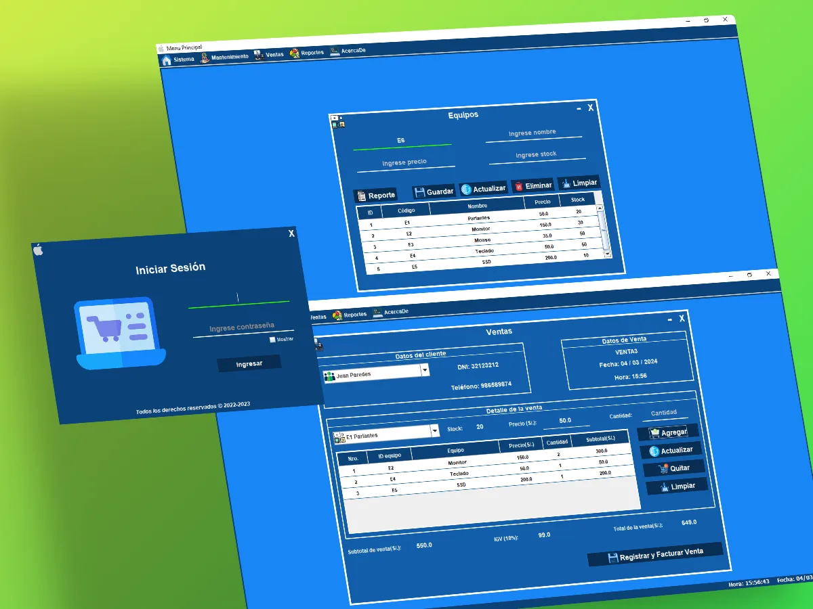

# Tech-World-App

_Software_ hecho para venta de equipos electrónicos.

## Tecnologías

- [x] **Java**
- [x] **MySQL**
- [x] **iTextPDF**
- [x] **JaspertReport**

## Ejecutar proyecto

1. Clonar proyecto: `git clone https://github.com/jmedinalezama/tech-world-app.git`
2. Abrir con el IDE eclipse (recomendado) o de preferencia
3. Crear la base de datos con el _script_ de la carpeta **bd/bdequiposelectronicos.sql**
4. En la clase **Conexion.java** del paquete **utils**, colocar credenciales correspondientes para conectarse con la base de datos
5. Ejecutar el proyecto desde la clase **FrmLogueo.java** del paquete **vistas**

**Nota 1:** Asegurarse que las librerías (_.jar_) de la carpeta Lib estén agregadas al _classpath_ del proyecto.

**Nota 2:** En caso exista errores al cargar las imágenes, se debe agregar al _classpath_ la carpeta **Images**

 <strong> by jmedinalezama 👨‍💻</strong>

